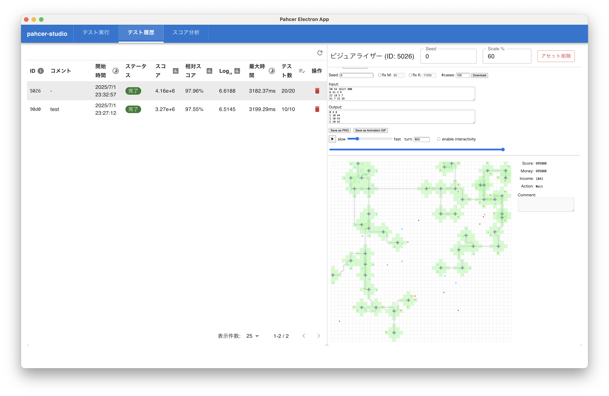
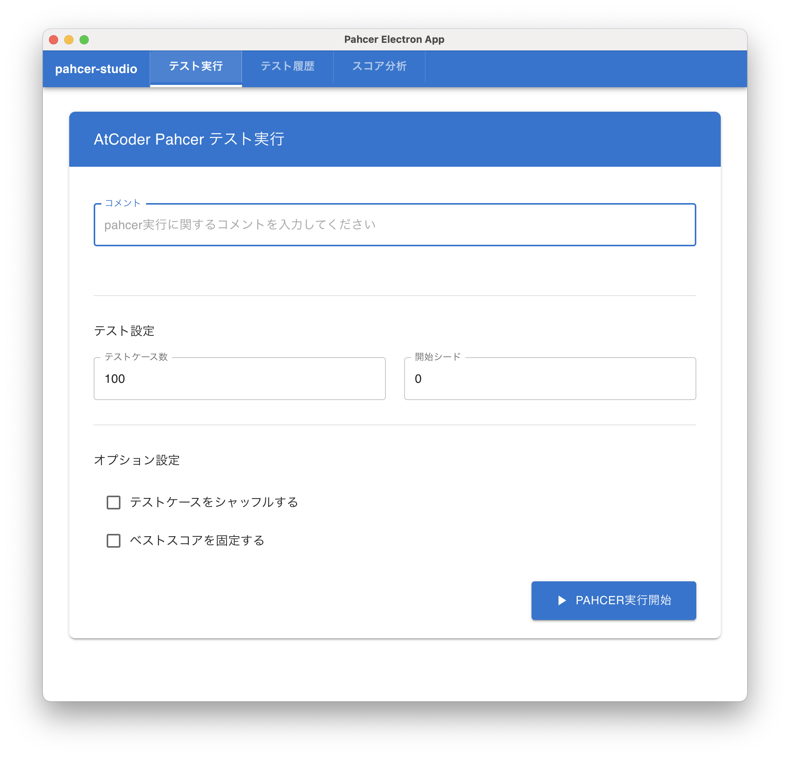
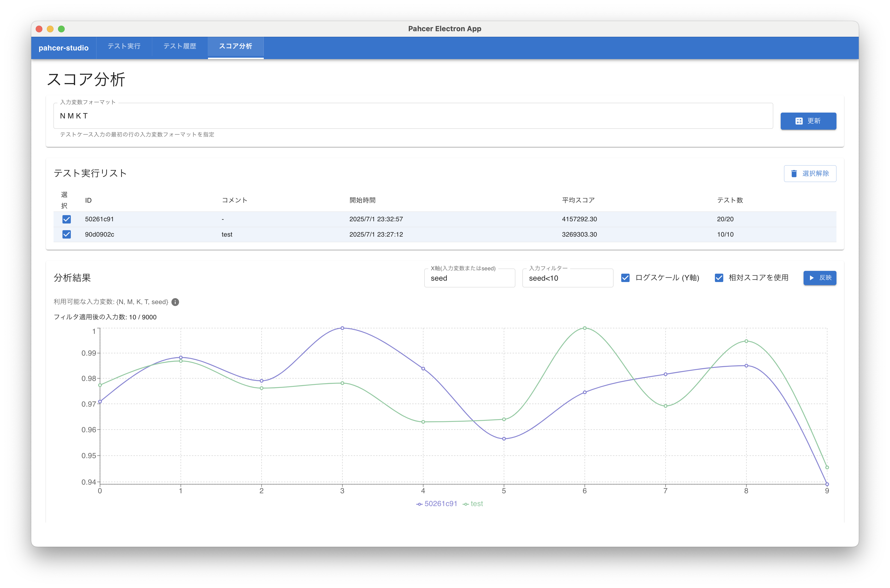

# pahcer-studio

**[pahcer](https://github.com/terry-u16/pahcer) ベースの AtCoder Heuristic Contest (AHC) テスト実行管理ツール**



terry_u16 さんが開発したテスト実行ツール **pahcer** を活用し、テスト実行・結果管理・分析機能を統合した Electron アプリケーションです。

## 🎯 開発の背景

AHCをやっている中で、以下のような問題を感じていました：

- **テスト実行の管理が煩雑** - pahcer では基本的に最新の結果しか持たない
- **改善効果の把握が困難** - どのコード変更が実際にスコア向上につながったか分からない
- **ビジュアライザでの確認が手間** - pahcerの実行結果をビジュアライザに貼り付けるのに手間がかかる
- **テストケース分析の手間** - 個別ケースでの強み・弱みが見えづらい

これらの課題を解決し、より効率的にアルゴリズム改善を行うために pahcer-studio を開発しました。

## ✨ 主要機能

### 🚀 テスト実行管理

- **GUI実行**: GUI から pahcer テストを開始
- **実行監視**: 実行状況とログをリアルタイムで表示
- **パラメータ設定**: テストケース数、シード値、シャッフルオプションの設定

### 🗂️ 履歴管理・比較

- **実行履歴一覧**: 過去の実行結果を時系列で表示
- **コメント機能**: 各実行にメモを記録
- **ビジュアライザ連携**: テストケース結果をビジュアライザで表示

### 📊 実行結果の分析・可視化

- **スコア推移グラフ**: 実行間でのスコア変化をグラフ表示
- **相対スコア評価**: ベストスコアとの比較による改善度計算
- **テストケース別分析**: 入力特徴量とスコアの相関関係の表示

---

> **注意**: このアプリケーションは [pahcer](https://github.com/terry-u16/pahcer) がインストールされていることを前提としています

# 使用方法

## 📋 前提条件

- **pahcer** がインストール済みであること（[インストール手順](https://github.com/terry-u16/pahcer)）
- **Node.js** (v16以上推奨)
- **yarn**

## 📁 セットアップ

### 1. フォルダ構成の準備

pahcer-studio は pahcer プロジェクトと同じディレクトリに配置する必要があります：

```
your-ahc-project/
├── main.cpp             # 開発したプログラム、言語は好みで選択してください
├── pahcer_config.toml    # pahcer の設定ファイル
├── tools/                # AHCから配布される tools フォルダ
│   ├── in/              # 入力ファイル
│   └── out/             # 出力ファイル
└── pahcer-studio/       # このリポジトリをクローンする場所
    ├── src/
    ├── package.json
    └── ...
```

### 2. pahcer プロジェクトの初期化

まず、AHC プロジェクトで pahcer を初期化してください：

```bash
cd your-ahc-project
pahcer init
```

### 3. pahcer-studio のクローン

AHC プロジェクトディレクトリ内で pahcer-studio をクローンします：

```bash
# your-ahc-project ディレクトリ内で実行
git clone https://github.com/yunix-kyopro/pahcer-studio.git
cd pahcer-studio
```

### 4. 依存関係のインストール

```bash
yarn install
```

## 🚀 実行

```bash
yarn start
```

Electron アプリケーションが起動し、GUI が表示されます。

# 機能一覧

pahcer-studioは3つの画面からなり、

- テスト実行
- 過去のテスト実行の管理・ビジュアライザでの確認
- 過去のテスト実行の分析

を行うことができます。

## テスト実行



この画面では pahcer のテスト実行を GUI から行うことができます。

**主な機能：**

- **実行パラメータ設定**: テストケース数、開始シード値を指定
  - なお、テストケースはあらかじめ別に用意しておく必要があります
  - 初期に配布される100ケース以外をテストに使いたい場合には、テストケース生成をしてください
- **オプション設定**: テストケースシャッフル、ベストスコア固定の選択
- **コメント機能**: 実行内容や変更点をメモとして記録
- **リアルタイム監視**: 実行状況とログをリアルタイムで表示

## 過去のテスト実行の管理


この画面では過去のテスト実行の一覧を管理し、ビジュアライザでの確認を行うことができます。

**主な機能：**

- **実行履歴一覧**: 過去の全実行を時系列で表示（実行日時、コメント、スコア情報）
- **詳細情報表示**: 平均スコア、相対スコア、実行時間などの統計情報
- **ビジュアライザ連携**: 選択したテストケースをビジュアライザで直接表示
  - 右上のSeedの値を変更すると、自動でinputとoutputが変更される
  - Scaleの値を変更してビジュアライザ部分の縮尺を調整可能
- **履歴管理**: 実行履歴の更新、削除などの管理機能

なお、初期状態ではビジュアライザのファイルがダウンロードされていません。
問題ごとのビジュアライザのURLを入力すると、必要なファイルをダウンロードしてビジュアライザを表示することができます。
ダウンロードしたファイルはpahcer-studio/public以下に保存されます。

## 過去のテスト実行の分析



この画面では複数の実行結果を比較・分析し、改善点を見つけることができます。

**主な機能：**

- **分析設定**: 入力特徴量フォーマットの設定とキャッシュ更新
  - テストケースごとのパラメータを分析するために、入力ファイルの1行目の変数の構成を入力("N M K"など)
  - 更新ボタンを押すとテストケースごとのパラメータをpahcer-studio/analysis_dataに保存
  - ここで指定した変数は分析で指定できるようになります
- **実行選択**: 分析対象とする実行を複数選択
- **スコア推移グラフ**: 選択した実行間でのスコア変化を可視化
  - **相対スコア評価**: ベストスコアとの比較による改善度の定量評価
  - **テストケース別分析**: 入力特徴量（N, M, K等）とスコアの相関関係を分析
  - **フィルタ機能**: seedや入力特徴量についてフィルタを設定可能
